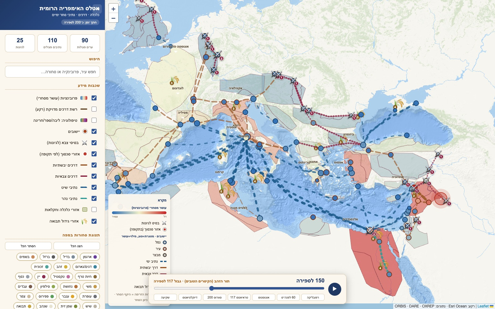
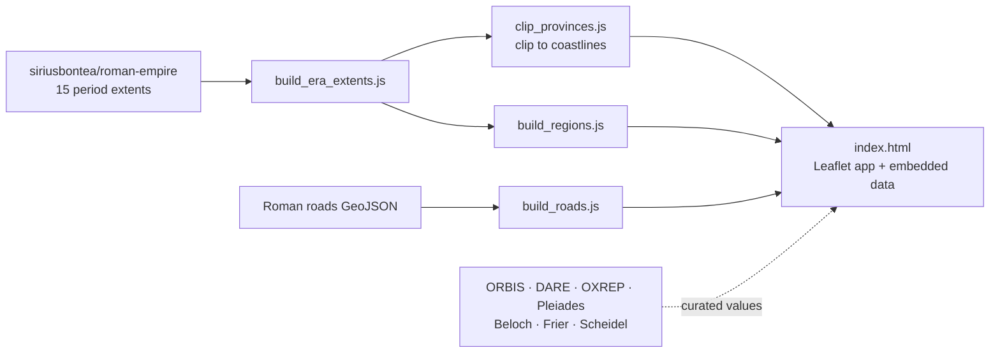

<div align="center">

# Roads of Rome · A Temporal Atlas of the Roman Empire

**An interactive, time-aware map of Roman economy, roads, trade, the army and demography from 500 BC to AD 476. It is built from scholarly open datasets and ships as a single self-contained HTML file.**




**[▶ Open the live atlas](https://pinchasrosenberg.github.io/roman-atlas/)**

</div>

---

## What you can explore

* **A playable timeline.** Cities appear when they are founded, then grow, shrink or fall, and the Empire's borders
  change through **15 terrain-accurate periods**. A guided tour stops at the Republic, 60 BC, Augustus, Trajan's
  maximum extent (117), the Severans (200), Diocletian and the decline.
* **90 settlements** (cities, ports and forts), each with population, wealth, a changing ethnic mix and its main
  exports and imports.
* **About 120 trade routes** by sea, land, river and military road, with volume and price in denarii per period. Sea
  trade dries up during the third-century crisis.
* **29 provinces** shaded by wealth and clipped to real coastlines (Egypt is separate from Syria), each with urban and
  rural population and its ethnic groups.
* **The army:** legion bases, troop numbers and the conflict zones of each period.
* **An accurate main-road network** as a background layer, a **trade calculator** between any two endpoints, and
  filters for 23 commodities: grain, wine, olive oil, garum, silver, gold, iron, tin, copper, lead, marble, papyrus,
  silk, purple dye, amber, ivory, slaves, wild beasts and more.
* Full Hebrew right-to-left interface with search over cities, provinces and goods.

## How it is built



* **One file, no backend.** `index.html` holds the whole application with its data embedded, so it runs from any
  static host or straight from disk. The only external requests are Leaflet (unpkg) and the Esri Ocean basemap tiles.
* **Reproducible geometry.** The Node scripts in `scripts/` turn the raw sources into the compact datasets in `data/`:
  period extents, coastline-clipped provinces and a filtered road network. They also generate the Word design
  specifications in `specs/`.
* **Time model.** Every entity carries its own validity window, and the map is re-derived for the selected year, so
  scrubbing the timeline never needs a network round-trip.

```bash
# regenerate the derived data (needs Node 18+)
node scripts/build_era_extents.js          # combined_extent.topojson -> era_extents.json
node scripts/clip_provinces.js             # provinces clipped to coastlines
node scripts/build_roads.js RomanRoadsWallsIntersect_v6.geojson
```

## Run it locally

```bash
python3 -m http.server 8000      # then open http://localhost:8000
```

Opening `index.html` directly also works.

## Sources (ground truth)

| Source | Used for |
|---|---|
| **ORBIS**, Stanford Geospatial Network Model of the Roman World | transport network and travel times |
| **DARE**, Digital Atlas of the Roman Empire (University of Gothenburg) | settlement locations and identification |
| **OXREP**, Oxford Roman Economy Project | mines, shipwrecks, economy over time |
| **AWMC / Barrington Atlas** | boundaries |
| **siriusbontea/roman-empire** | terrain-accurate extents for 15 periods and the road network |
| **Pleiades · Vici.org · DARMC · Wikidata** | gazetteers and dating |
| Beloch (1886), Frier (*CAH* XI), Scheidel | demography |

All quantities (prices, populations, volumes) are source-based **estimates for illustration**.

## Related projects

* [**wwii-atlas**](https://github.com/pinchasrosenberg/wwii-atlas) is an interactive WWII atlas backed by a public
  knowledge graph and a read-only API.
* [**wwii-build-manager**](https://github.com/pinchasrosenberg/wwii-build-manager) is a deterministic orchestrator for
  Codex and Claude Code workers.

## License

Code: MIT © Pinchas Rosenberg. Data remains under the licenses of the sources listed above.
